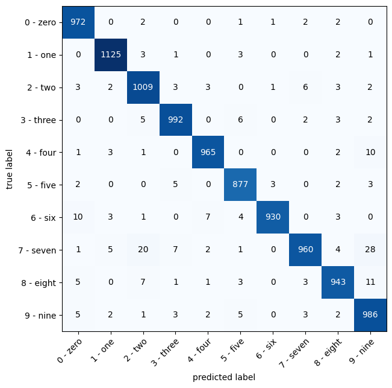

# MNIST Digit Classification using PyTorch

This project implements a Convolutional Neural Network (CNN) for digit classification on the MNIST dataset using PyTorch. The model is trained to recognize handwritten digits from 0 to 9 with an accuracy of approximately 97%.
The notebook of this project is provided in the repository, It can be also accessed from [here](https://colab.research.google.com/drive/1shMzQA2Z_7XpWtnbMIFHshYeR7Av4Z3C?usp=sharing)

## Table of Contents

- [Introduction](#introduction)
- [Dataset](#dataset)
- [Requirements](#requirements)
- [Installation](#installation)
- [Usage](#usage)
- [Training the Model](#training-the-model)
- [Evaluation](#evaluation)
- [Results](#results)
- [License](#license)

## Introduction

The MNIST dataset is a collection of 70,000 images of handwritten digits (0-9). It is widely used for training various image processing systems. In this project, we employ a CNN to classify these digits efficiently.

## Dataset

The MNIST dataset consists of:
- **Training set**: 60,000 images
- **Test set**: 10,000 images

Each image is a grayscale image of size 28x28 pixels.
The data set is provided in the github repository. You can also download it from the official website [here](https://yann.lecun.com/exdb/mnist/)

## Requirements

To run this project, you need the following packages:

- Python 3.x
- PyTorch
- torchvision
- numpy
- matplotlib

You can install the required packages using the `requirements.txt` file.

## Installation

1. Clone the repository:

   ```bash
   git clone <forked repository>
    ```
2. Create and activate a virtual environment

    ```bash
    python -m venv myenv
    myenv\Scripts\activate  # Windows
    source myenv/bin/activate  # macOS/Linux
    ```
3. Install the required packages
    ```bash
    pip install -r requirements.txt
    ```
4. Run the python file
    ```bash
    python app.py
    ```
    Then Go to http://127.0.0.1:7860 or the url displayed on your terminal


# Training the Model

The model architecture consists of the following components:

* Convolutional Block 1: A convolutional layer followed by a ReLU activation function.
* Convolutional Block 2: A second convolutional layer with a ReLU activation function and max pooling.
* Fully Connected Layer: A linear layer that outputs predictions for the 10 digit classes.

The model is trained using:

* Loss Function: Cross Entropy Loss
* Optimizer: Stochastic Gradient Descent (SGD)

# Evaluation
After training, the model is evaluated on the test set to determine its accuracy in recognizing handwritten digits.

**Confusion Matrix**




# Results
The trained model achieves an accuracy of approximately 97% on the test set, demonstrating its effectiveness in classifying handwritten digits.

# License
This project is licensed under the MIT License.

